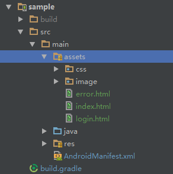

# AndServer
`AndServer` is a Web server of Android, support for the deployment of static website, dynamic website, support dynamic interface (Equivalent to Servlet of java ).

**[中文文档](./README-CN.md)**

----

# Features
1. Dynamic website deployment.
2. Static website deployment.
3. Dynamic http API.
4. Upload file to android application.
5. Download file from android application.
6. Support high concurrency.

# Dependencies
* Gradle
```groovy
compile 'com.yanzhenjie:andserver:1.0.3'
```

* Maven
```xml
<dependency>
  <groupId>com.yanzhenjie</groupId>
  <artifactId>andserver</artifactId>
  <version>1.0.3</version>
  <type>pom</type>
</dependency>
```

* Eclipse
[Download Jar File](./Jar/andserver.jar?raw=true)

# Usage
The best tutorial is sample, recommended download preview.

## Create Server
```java
AndServer andServer = new AndServer.Build()
    ...
    .build();

// Create server.
Server mServer = andServer.createServer();
...

// Start server.
mServer.start();
...

// Stop server.
mServer.stop();
...

// Server is running ?
boolean running = mServer.isRunning();
```

## Port & Response Timeout
```java
AndServer andServer = new AndServer.Build()
    .port(8080) // Default 8080, can be any port.
    .timeout(10 * 1000) // But for MS, the default is 10 * 1000 ms.
    ...
    .build();
...
```

## Website deployment
The deployment website is through the `Website` interface, you can implement it. `AndServer` provides two default implementations:  

* [AssetsWebsite](./andserver/src/main/java/com/yanzhenjie/andserver/website/AssetsWebsite.java)
* [StorageWebsite](./andserver/src/main/java/com/yanzhenjie/andserver/website/StorageWebsite.java)

Through their registered website, the default home page is：  

* `http://ip:port/`
* `http://ip:port/youPath`
* `http://ip:port/youPath/index.html`

### Register the website
```java
Website website = new AssetsWebsite(AssetManager, youPath);
// or
Website website = new StorageWebsite(youPath);

AndServer andServer = new AndServer.Build()
    ...
    .website(website);
    .build();
```

### AssetsWebsite usage
Use it when your static site content is placed under assets.  

The way to use is:  
```java
AssetManager mAssetManager = getAssets(); //AssetManager can not be closed.

Website website = new AssetsWebsite(mAssetManager, youPath);
```

* If the website root directory under the assets, then the incoming `""`, such as:  


```java
Website website = new AssetsWebsite(mAssetManager, "");
```

Then your default home page is:  
`http://ip:port`  
`http://ip:port/index.html`  

Other page addresses is:  
`http://ip:port/login.html`  
`http://ip:port/error.html`  

For example:  
```
http://192.168.1.12:8080/index.html  
http://192.168.1.12:8080/login.html
```

* If the root directory of the site is in the subdirectory of assets, then the relative path to the directory, such as the site in the assets `web` directory, such as:  


```java
Website website = new AssetsWebsite(mAssetManager, "web");
```

Then your default home page is:  
`http://ip:port`  
`http://ip:port/web`  
`http://ip:port/web/index.html`  

Other page addresses is:  
`http://ip:port/web/login.html`  
`http://ip:port/web/error.html`  

For example:  
```
http://192.168.1.12:8080
http://192.168.1.12:8080/web
http://192.168.1.12:8080/web/index.html
http://192.168.1.12:8080/web/error.html  
http://192.168.1.12:8080/web/login.html  
```

### StorageWebsite usage
Use it when your static site is on a storage device, such as your site under SD card.  

The way to use is:  
```java
Website website = new StorageWebsite(youPath);
```

It is simple, the absolute path into your website root directory on it, for example, your site in the SD card under the `www` directory:  
```java
File file = new File(Environment.getExternalStorageDirectory(), "www");
String websiteDirectory = file.getAbsolutePath();

Website website = new StorageWebsite(websiteDirectory);
```

Access address and `AssetsWebsite` the same reason.

## Http API
Http API is through the `RequestHandler` interface registration, it is a `java interface`, it's the same as `JavaEE's Servlet`.  

You need to `implement` it, and then registered to `AndServer` on it, such as:  
```java
public class RequestLoginHandler implements RequestHandler {

    @Override
    public void handle(HttpRequest req, HttpResponse res, HttpContext con) {
        Map<String, String> params = HttpRequestParser.parse(request);

        // Request params.        
        String userName = params.get("username");
        String password = params.get("password");

        if ("123".equals(userName) && "123".equals(password)) {
            StringEntity stringEntity = new StringEntity("Login Succeed", "utf-8");
            response.setEntity(stringEntity);
        } else {
            StringEntity stringEntity = new StringEntity("Login Failed", "utf-8");
            response.setEntity(stringEntity);
        }
    }
}
```

And then register it in `AndServer`:    
```java
AndServer andServer = new AndServer.Build()
    ...
    .registerHandler("login", new RequestLoginHandler())
    .build();
```

Now you can get a unique access address: `http://ip:port/login`, for example:  
```
http://192.168.1.12:8080/login?username=123&password=123
```

For example of file download and file upload, please refer to sample.

## Html submit form
In the `action` of the `Html's form` fill in you register RequestHandler key, and then you can get the form parameters in the `handle(HttpRequest, HttpResponse, HttpContext)` method of the `RequestHandler`.  

Such as the top of the `Login RequestHandler`:  
```html
<form id="form1" method="post" action="login">
...
</form>
```

## Listens on server status
```java
private Server.Listener mListener = new Server.Listener() {
    @Override
    public void onStarted() {
        // The server started successfully.
    }

    @Override
    public void onStopped() {
        // The server stops.
    }

    @Override
    public void onError(Exception e) {
        // There was an error when starting the server, usually the port was occupied.
    }
};

AndServer andServer = new AndServer.Build()
    ...
    .listener(mListener)
    .build();
```

# License
```text
Copyright 2017 Yan Zhenjie

Licensed under the Apache License, Version 2.0 (the "License");
you may not use this file except in compliance with the License.
You may obtain a copy of the License at

   http://www.apache.org/licenses/LICENSE-2.0

Unless required by applicable law or agreed to in writing, software
distributed under the License is distributed on an "AS IS" BASIS,
WITHOUT WARRANTIES OR CONDITIONS OF ANY KIND, either express or implied.
See the License for the specific language governing permissions and
limitations under the License.
```
